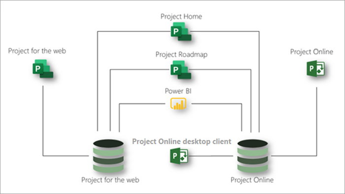

# Descrizione del servizio Microsoft Project

## Panoramica

Microsoft Project offre le applicazioni seguenti per soddisfare le esigenze dell'organizzazione per la gestione di progetti e lavoro:

- Project per il web
- Project Online 
- Project Online client desktop

Questo articolo consente di comprendere quali applicazioni vengono fornite in ogni sottoscrizione Project e quali funzionalità offre ogni applicazione.

### Project per il web

Project per il Web è l'offerta più recente di Microsoft per la gestione del lavoro e dei progetti basata sul cloud. Project per il Web offre funzionalità di gestione del lavoro semplici e potenti per soddisfare la maggior parte delle esigenze e dei ruoli. Project manager e membri del team possono usare Project per il Web per pianificare e gestire il lavoro di qualsiasi dimensione.

Project per il Web è basato su Microsoft Power Platform. Power Platform è costituita da PowerApps, Power Automate, Power BI e Microsoft Dataverse. Project per i dati Web è archiviato in Microsoft Dataverse. 

Project per il Web è disponibile tramite tre sottoscrizioni: Project - Piano 1, Project - Piano 3 e Project - Piano 5. Le funzionalità elencate Project [per le funzionalità Web](#project-for-the-web-features) interagiscono solo con i dati nell'Project per l'archivio dati Web.

### Project Online
 
Project Online è una soluzione online flessibile per Project Portfolio Management (PPM) e il lavoro quotidiano. Project Online offre potenti funzionalità di gestione dei progetti per la pianificazione, la definizione delle priorità e la gestione dei progetti e degli investimenti nel portfolio di progetti praticamente ovunque su &mdash; quasi tutti i dispositivi. Project Online può essere usato dagli amministratori, dai responsabili e dagli utenti di portfolio, dai responsabili e dalle risorse dei progetti, nonché dai team leader e dai membri dei team.

Project Online è basato sulla piattaforma SharePoint e archivia i dati nell SharePoint archivio dati.

Project Online è disponibile tramite due sottoscrizioni: Project - Piano 3 e Project - Piano 5. Le funzionalità elencate in [Project Online interagiscono](#project-online-features) solo con i dati nell Project Online SharePoint archivio dati.

La funzionalità dei membri del team Project Online è disponibile tramite una sottoscrizione Project Online Essentials o Project - Piano 1 team. Project Online Essentials è una sottoscrizione  di componente aggiuntivo per i membri del team per i clienti che hanno Project - Piano 3 o Project - Piano 5 sottoscrizione. Project Online Essentials e Project - Piano 1 ai membri del team un'interfaccia Web per eseguire aggiornamenti di attività e tempi per i progetti gestiti in Project Online.

I membri del team con Project Online Essentials o Project - Piano 1 possono eseguire le Project Online seguenti:

- Usare un'interfaccia basata sul Web
- Aggiornamento attività, problemi e rischi
- Invio di schede attività
- Condividere documenti e collaborare con Microsoft Teams o Skype for Business utenti

Project Online Essentials non include Project per il Web. Project - Piano 1 include sia Project web che Project Online Essentials.

### Project Online client desktop

Microsoft Project Online client desktop è un programma di gestione dei progetti che include pianificazione automatizzata, gestione delle risorse di progetto e creazione di report predefiniti. Project Online client desktop può essere utilizzato come applicazione autonoma o può connettersi a Project Online. Project Online client desktop è la versione di sottoscrizione del client desktop Project Professional ed è disponibile in Project - Piano 3 e Project - Piano 5 sottoscrizioni.

### Utilizzo Project per il Web e Project Online insieme

Sebbene Project web e Project Online siano applicazioni separate, è possibile utilizzarle affiancate. È possibile visualizzare tutti i progetti di entrambe le applicazioni in Project Home. È possibile utilizzare la funzionalità Project roadmap per creare roadmap che includono progetti di entrambe le applicazioni. È inoltre possibile utilizzare Power BI e il Project per il pacchetto di Power BI Web per ottenere informazioni dettagliate su progetti e risorse tra le due applicazioni. 3

Questo diagramma mostra il modo in cui le applicazioni possono lavorare insieme.

In futuro, Microsoft si concentrerà sulla Project per le innovazioni web. Tuttavia, è possibile continuare a usare Project Online sicurezza perché continuerà a ricevere miglioramenti chiave delle prestazioni e della sicurezza.

## Microsoft Project sottoscrizioni

Microsoft Project è disponibile tramite tre diverse sottoscrizioni per soddisfare al meglio le esigenze dell'organizzazione. Queste sottoscrizioni sono Project - Piano 1, Project - Piano 3 e Project - Piano 5. Per confrontare le funzionalità tra sottoscrizioni, vedere [Disponibilità delle funzionalità tra le applicazioni e le sottoscrizioni.](#feature-availability-across-applications-and-subscriptions)  

|Prodotto | Piano 1 | Piano 3 | Piano 5 |
|--------|-----------------------------|------------------------|------------------------|
|Project per il web |**x**  | **x x x** | **x x x** |
|Project Online |**x** |**x x x**| **x x x x** |
|Project Online client desktop | |**x**|**x**|

Nella tabella precedente, il numero di controlli (**x**) indica il livello generale di funzionalità fornite da un piano. Ad esempio, per Project Online, il piano 5 offre più funzionalità rispetto al Piano 3.

## Disponibilità delle funzionalità tra le applicazioni e le sottoscrizioni

### Project per le funzionalità Web

Le funzionalità elencate in questa sezione interagiscono solo con i dati Project per l'archivio dati Web. Tutte queste funzionalità sono disponibili in tutte le Microsoft Project: Project - Piano 1, Project - Piano 3 e Project - Piano 5.  

| Funzionalità | Descrizione | Office 365 licenze | Piano 1 | Piano 3 | Piano 5 |
|--------|-----------------------------|--------------|------------|------------|------------|
|**Project, attività e gestione del tempo**||||||
|Visualizzazione Bacheca | Tenere traccia visivamente delle attività di progetto per migliorare il monitoraggio del flusso di lavoro e dello stato utilizzando schede attività personalizzate e personalizzate.| Sola visualizzazione | Sì | Sì| Sì|
|Dipendenze | Impostare e tenere traccia visivamente delle dipendenze tra le attività.| Sola visualizzazione | Sì | Sì| Sì|
|Visualizzazione Griglia | Pianificare e gestire i progetti utilizzando una visualizzazione gerarchica a griglia delle attività. | Sola visualizzazione | Sì | Sì | Sì |
|Attività cardine | Stabilire e tenere traccia delle attività cardine importanti di progetti e attività.|Sola visualizzazione | Sì | Sì | Sì |
|Project Home | Tenere traccia e gestire i risultati finali utilizzando le date di inizio e fine e la programmazione automatica.| Sì | Sì | Sì | Sì |
|Pianificazione delle attività | Ottieni una visione a volo d'occhio dei progetti a cui hai lavorato di recente, oltre a progetti importanti da monitorare da vicino.| Sola visualizzazione | Sì | Sì | Sì |
|Visualizzazione Sequenza temporale (diagramma di Gantt) | Tenere traccia e comprendere visivamente le date, le dipendenze e le assegnazioni del progetto in una visualizzazione gerarchica della sequenza temporale.|Sola visualizzazione | Sì | Sì | Sì |
|Attività di riepilogo | Pianificare, gestire e tenere traccia dei risultati finali e delle fasi utilizzando le attività di riepilogo.| Sola visualizzazione | Sì | Sì | Sì |
|Creare e utilizzare campi personalizzati delle attività | Aggiungere campi personalizzati locali alle attività di un progetto, aggiungere dati a questi campi o aggiornare i dati in questi campi.| Solo visualizzazione | Sì | Sì | Sì |
|**Collaborazione** ||||||
|Microsoft Teams integrazione | Collaborare ai progetti in Microsoft Teams. 1 | Sì | Sì | Sì | Sì |
|**Gestione delle risorse e dei programmi** ||||||
|Project configurazione del team | Gestire un team di progetto aggiungendo e rimuovendo membri e impostando il calendario di lavoro. | No | Sì | Sì | Sì |
|Creare richieste di risorse12 |  | Solo visualizzazione | Solo visualizzazione | Sì | Sì |
|Accettare una proposta di prenotazione12 |  | Solo visualizzazione | Solo visualizzazione | Sì | Sì |
|Creare e aggiornare prenotazioni per soddisfare le richieste di risorse12 |  | Solo visualizzazione | Solo visualizzazione | Solo visualizzazione | Sì |
|Gestire competenze/competenze nelle risorse |  | Solo visualizzazione | Solo visualizzazione | Sì | Sì |
|Roadmap | Crea roadmap visive e interattive tra progetti Microsoft Project Online, Microsoft Project per il Web e Azure Boards progetti. 2 Con Project - Piano 1 si ottiene l'accesso di sola lettura alle roadmap. Con Project - Piano 3 o Project - Piano 5, è anche possibile creare roadmap. | Solo visualizzazione | Solo visualizzazione | Sì | Sì |
|**Reporting**3 ||||||
|Leggere report da *Project per i dati Web* | Visualizzare report predefiniti o personalizzati e dashboard per comprendere i dati relativi a progetti, programmi, portfolio e risorse. | Sì | Sì | Sì | Sì |
|Creare report utilizzando *Project per i dati Web* | Comprendere i dati importanti per l'organizzazione creando report personalizzati basati su report predefiniti o da zero.  Creare dashboard personalizzati per soddisfare esigenze specifiche dell'organizzazione. | No | Sì | Sì | Sì |
|**Usabilità** ||||||
|Creazione condivisa | Collaborare con le parti interessate e i membri del team per creare, modificare e aggiornare contemporaneamente elenchi di attività, pianificazioni di progetti e altro ancora.| Sola visualizzazione | Sì | Sì | Sì |
|Indicatori grafici | Comprendere lo stato, le assegnazioni e altro ancora delle attività con indicatori grafici.| Sola visualizzazione | Sì | Sì | Sì |
|**Personalizzazione e integrazione**||||||
|Usare l'applicazione Project di configurazione | Utilizzare l'applicazione Project predefinita per visualizzare un progetto, creare un nuovo progetto, aggiungere nuovi dati a un progetto o aggiornare i dati del progetto esistenti. | Solo visualizzazione | Sì | Sì | Sì |
|Personalizzare visualizzazioni e moduli 4 | Personalizzare solo le visualizzazioni e i moduli nell'applicazione Project personalizzata. | Solo visualizzazione | Sì | Sì | Sì |
|Usare colonne personalizzate | Visualizzare, aggiungere, aggiornare o eliminare dati in una colonna aggiunta a una tabella. | Solo visualizzazione | Sì | Sì | Sì |
|Utilizzare tabelle personalizzate 5 | Creare e definire tabelle personalizzate per contenere dati aggiuntivi necessari per progetti, portfolio e così via. | Solo visualizzazione | Sì | Sì | Sì |
|**Power Automate flussi di lavoro e processi aziendali** 7 ||||||
| | Definire e usare Power Automate cloud che utilizzano Project dati, incluse tabelle e colonne personalizzate. | No | Sì | Sì | Sì |
| | Definire Power Automate processi aziendali che utilizzano Project dati, incluse tabelle e colonne personalizzate. | No | No | Sì | Sì |
| | Utilizzare Power Automate processi aziendali che utilizzano Project dati. | No | Sì | Sì | Sì |
|**Sicurezza e gestione degli utenti**||||||
|Office Gruppi moderni | Creare un team di progetto per collaborare e configurare facilmente una raccolta di risorse da condividere con i membri del team. | Sì | Sì | Sì | Sì |
|**App di terze parti**||||||
|Connessione per *Project web* con app di terze parti 4 | Utilizzare un'applicazione personalizzata o di terze parti per visualizzare, creare, aggiornare o eliminare dati Project in qualsiasi tabella Project nativa. | Solo visualizzazione11 | Sì | Sì | Sì |

### Funzionalità di Project Online

Le funzionalità elencate in questa sezione interagiscono solo con i dati nell Project Online SharePoint archivio dati. I membri del team con Project Online Essentials o Project - Piano 1 possono eseguire alcune Project Online funzioni. Per ulteriori informazioni, vedere [Microsoft Project service description - Service Descriptions | Documenti Microsoft](/office365/servicedescriptions/project-online-service-description/project-online-service-description#project-online).  

|Funzionalità | Descrizione | Project - Piano 3 | Project - Piano 5 |
|--------|-------------|-----------------------------|------------------------|
|**Project, attività e gestione del tempo**||||
|Avvisi e promemoria | Tieniti in programma per le attività future importanti e gli eventi di progetto con promemoria in Outlook e Microsoft Teams. 1| Sì | Sì |
|Linee di base | Impostare le previsioni di progetto per monitorare le prestazioni correnti rispetto alle prestazioni precedenti utilizzando il Project Web App.| Sì | Sì |
|Visualizzazione Bacheca | Tenere traccia visivamente delle attività di progetto per migliorare il flusso di lavoro e il monitoraggio dello stato. | Sì | Sì |
|Percorso critico | Tieni traccia visivamente delle attività che rappresentano il percorso più lungo del progetto usando il Project Web App.| Sì | Sì |
|Gestione risultati finali | Tenere traccia e gestire i risultati finali utilizzando le date di inizio e fine e la programmazione automatica.| Sì | Sì |
|Dipendenze | Impostare e tenere traccia visivamente delle dipendenze tra le attività.| Sì | Sì |
|Visualizzazione Gantt | Tenere traccia visivamente e comprendere le date, le dipendenze e le assegnazioni del progetto in un diagramma di Gantt gerarchico utilizzando il Project Web App.| Sì | Sì |
|Visualizzazione Griglia | Pianificare e gestire i progetti utilizzando una visualizzazione gerarchica a griglia delle attività tramite il Project Web App.| Sì | Sì |
|Gestione dei problemi e dei rischi | Identificare e tenere traccia di problemi e rischi a livello di progetto e attività.| Sì | Sì |
|Progetti principali | Raggruppare progetti correlati più piccoli in un singolo progetto principale utilizzando il Project Web App. | Sì | Sì |
|Notifiche | Tieniti al passo con le assegnazioni di attività, lo stato e gli eventi importanti del progetto con Outlook e Teams notifiche. 1 | Sì | Sì |
|Project Home | Ottieni una visione a volo d'occhio dei progetti a cui hai lavorato di recente, oltre a progetti importanti da monitorare da vicino.| Sì | Sì |
|Project delle versioni | Confrontare versioni diverse di un progetto con un report che mostra cosa è cambiato tra le versioni. | Sì | Sì |
|Attività di riepilogo | Pianificare, gestire e tenere traccia dei risultati finali e delle fasi utilizzando le attività di riepilogo nella Project Web App. | Sì | Sì |
|Pianificazione delle attività | Usa le date di inizio e fine delle attività, il lavoro, i tempi di lead e ritardo e le dipendenze per ottenere una programmazione accurata delle date del progetto utilizzando il Project Web App. | Sì | Sì |
|Aggiornamenti delle attività | Acquisisci tempo e stato con commenti sulle attività del progetto, sul lavoro non di progetto e sull'orario non lavorativo. | Sì | Sì |
|Sequenze temporali | Tieni traccia visivamente e comprendi le date, le dipendenze e le assegnazioni del progetto in una visualizzazione sequenza temporale usando il Project Web App. | Sì | Sì |
|Schede attività | I membri del team possono immettere il tempo e lo stato in base alle attività, al lavoro non di progetto e all'orario non lavorativo. | Sì | Sì |
|Approvazioni scheda attività | I membri del team possono inviare schede attività per l'approvazione. I responsabili delle risorse e i supervisori possono rivedere, approvare e rifiutare le schede attività inviate. | Sì | Sì |
|Configurazione dell'orario non lavorativo | Consente di aggiungere festività, giorni di ferie, permessi per malattia e altri giorni non lavorativi nella pianificazione del progetto. | No | Sì |
|**Collaborazione** ||||
|Allegati | Allegare documenti, immagini e altri file a livello di team, progetto o attività. Gestire questi allegati in una raccolta centrale a livello di team o di progetto. | Sì | Sì |
|Membri esterni del team |Collaborare con persone esterne all'organizzazione concedendo loro l'accesso per visualizzare e interagire con progetti, attività e documenti. 6 | Sì | Sì |
|Siti di progetto | Creare e personalizzare un hub per la collaborazione e i documenti per un progetto. | Sì | Sì |
|Microsoft Teams integrazione | Collaborare ai progetti in Microsoft Teams. 1 | Sì | Sì |
|**Gestione delle richieste** ||||
|Project impostazione del flusso di lavoro di approvazione della richiesta | Creare i flussi di lavoro necessari per valutare, definire le priorità e approvare la domanda in arrivo. | No | Sì |
|Project moduli di richiesta | Acquisisci dati importanti sulla domanda in arrivo per aiutarti a valutare e definire le priorità per il nuovo lavoro. | No | Sì |
|Project richieste | Tenere traccia, gestire, valutare e definire le priorità della domanda in arrivo dall'organizzazione e da clienti e partner esterni. | Sì | Sì |
|**Gestione di risorse, programmi e portfolio** ||||
|Project costing e budgeting | Confrontare l'avanzamento pianificato e il budget con il tempo e i costi effettivi utilizzando il Project Web App. | Sì | Sì |
|Project configurazione del team | Gestire un team di progetto aggiungendo e rimuovendo membri, impostando livelli di allocazione e aggiungendo membri esterni. | Sì | Sì |
|Visualizzazioni capacità risorse | Tenere traccia e gestire la capacità delle risorse a livello di progetto, team e organizzazione. | Sì | Sì |
|Costing delle risorse | Tenere traccia e gestire i costi delle risorse del progetto. | Sì | Sì |
|Impegni delle risorse (prenotazioni) | Project manager possono inviare richieste di risorse in base al ruolo, alle competenze o al nome. I responsabili delle risorse possono esaminare le richieste e assegnare le migliori risorse disponibili. |Sì8 | Sì9 |
|Pianificazione della capacità delle risorse | Tenere traccia e gestire la capacità delle risorse a livello di progetto, team e organizzazione. | No | Sì |
|Roadmap | Crea roadmap visive e interattive tra progetti Microsoft Project Online, Microsoft Project per il Web e Azure Boards progetti. 2 | Sì | Sì |
|Analisi e definizione delle priorità del portfolio | Identificare, selezionare e distribuire portfolio di progetti in linea con la strategia aziendale dell'organizzazione e ottimizzare il ritorno sull'investimento (ROI). | No | Sì |
|Dashboard/portali | Comprendere lo stato, la definizione delle priorità e altro ancora a livello di portfolio, programma, progetto, attività, team e risorse con dashboard interattivi in tempo reale. | Sì | Sì |
|Work, generic, and material resources | Aggiungere risorse a un progetto, ad esempio risorse di lavoro come persone, risorse generiche come falegnami e risorse materiali come computer e cemento. | Sì | Sì |
|**Reporting**3 ||||
|Report out-of-box | Utilizzare report predefiniti per comprendere i dati relativi a progetti, programmi, portfolio e risorse. | Sì | Sì |
|Report personalizzati | Comprendere i dati importanti per l'organizzazione creando report personalizzati basati su report predefiniti o da zero. | Sì | Sì |
|Dashboard e portali | Creare dashboard e portali personalizzati per soddisfare esigenze specifiche dell'organizzazione. | Sì | Sì |
|**Personalizzazione e integrazione**||||
|Marchio personalizzato | Personalizza la Project distribuzione usando il tuo marchio, logo e colori. | No | Sì |
|Custom fields | Aggiungere campi personalizzati a livello di progetto, attività e risorsa per tenere traccia dei dati importanti per l'organizzazione e i progetti. | Sì | Sì |
|Formule | Calcolare e acquisire dati importanti utilizzando formule tra attività e progetti. | Sì | Sì |
|PowerApps | Crea e usa soluzioni per web e dispositivi mobili (tramite OData) con PowerApps. 4 | Sì | Sì |
|Flussi di lavoro | Automatizzare e integrare i processi aziendali (tramite OData) con Power Automate. 7 | Sì | Sì |
|Integrazione di Microsoft 365 | Collaborare, gestire documenti e altro ancora usando strumenti e applicazioni Microsoft familiari. 1 | Sì | Sì |
|Integrazione di Microsoft Planner | Connessione Project attività a un piano planner e tenere traccia del lavoro dettagliato in Planner. 1 | Sì | Sì |
|**Gestione di sicurezza, utenti e servizi**||||
|Integrazione con Active Directory | Creare team da qualsiasi membro di Active Directory dell'organizzazione. 10 | Sì | Sì |
|Gestione degli utenti | Gestire i ruoli e le autorizzazioni di utenti e gruppi a livello di progetto, team e organizzazione. | No | Sì |
|Amministrazione dei servizi | Pianificare, installare e configurare, gestire ed estendere l'ambiente Microsoft Project come parte dell'Office 3651. | No | Sì |

#### Note

1 Richiede un abbonamento Office o Microsoft 365 commerciale. 
2 Azure Boards acquistati separatamente. 
3 Reporting for Project for the web and Project Online using Power BI requires a Power BI license. 
4 La creazione e l'utilizzo di Power Apps separati oltre all'applicazione Project che accede a Project per i dati dei clienti Web o Project Online richiede una sottoscrizione Power Apps separata. 
5 Limitato a 5 tabelle personalizzate. 
6 Project Online licenze per gli utenti esterni seguono lo stesso criterio per gli utenti interni. Qualsiasi interazione in un sito Project Online richiede una Project - Piano 3 o Project - Piano 5 abbonamento. 
7 Power Automate all'interno Project è limitato al contesto dell'Project applicazione. Ciò significa che, sia per i trigger che per le azioni, i diritti di flusso inclusi in Project possono:

- Connessione a qualsiasi origine dati all'interno dei diritti di utilizzo dell'Project applicazione:
  - Origini dati disponibili tramite connettori standard
  - Project dati tramite il connettore Microsoft Dataverse
- Essere attivati direttamente dall'Project applicazione (tramite trigger/azione incorporati)

Se il flusso è isolato e non ha nulla a che fare con l Project appliczione, sarà necessario acquistare una licenza della piattaforma. 
8 Gli utenti con una sottoscrizione Project - Piano 3 o Project - Piano 5 possono inviare richieste di coinvolgimento delle risorse. Non possono esaminare, soddisfare o approvare le richieste di coinvolgimento delle risorse. 
9 Gli utenti con una sottoscrizione Project - Piano 5 possono esaminare, soddisfare e approvare le richieste di coinvolgimento delle risorse. 
10 Active Directory richiede una sottoscrizione separata.  
11 Solo i diritti di visualizzazione vengono concessi solo dall'interno di un'app Power.  
12 I clienti con una licenza di Microsoft Project Piano 3/5 possono utilizzare la pianificazione delle risorse universali solo per pianificare le tabelle Project e Attività nel contesto di un progetto.  

### Project Online client desktop

| Funzionalità | Descrizione |
|--------|-------------|
|**Project e gestione delle attività**||
|Linee di base | Impostare le previsioni di progetto per monitorare le prestazioni correnti rispetto alle prestazioni precedenti. |
|Visualizzazione calendario | Tenere traccia delle scadenze e delle attività importanti per progetti e attività in una visualizzazione calendario settimanale o mensile. |
|Percorso critico | Tenere traccia visivamente delle attività che rappresentano il percorso più lungo del progetto. |
|Scadenze | Stabilire e tenere traccia di scadenze importanti per progetti e attività. |
|Dipendenze | Impostare e tenere traccia visivamente delle dipendenze tra le attività. |
|Visualizzazione Gantt | Tenere traccia e comprendere visivamente le date, le dipendenze e le assegnazioni dei progetti in una visualizzazione Gantt gerarchica. |
|Visualizzazione Griglia | Pianificare e gestire i progetti utilizzando una visualizzazione gerarchica a griglia delle attività. |
|Progetti principali | Raggruppare progetti correlati più piccoli in un singolo progetto principale. |
|Attività cardine | Stabilire e tenere traccia delle attività cardine importanti di progetti e attività. |
|Diagramma reticolare | Visualizzare attività, dipendenze e il percorso critico del progetto in una visualizzazione diagramma reticolare. |
|Pianificazione delle attività | Utilizzare le date di inizio e fine delle attività, le risorse, il lavoro, i tempi di lead e ritardo e le dipendenze per ottenere una programmazione accurata delle date del progetto |
|Pianificazione del team | Tenere traccia dell'allocazione e della capacità di tutti i membri del team di progetto, inclusi il lavoro non di progetto e l'orario non lavorativo.|
|Sequenze temporali | Tenere traccia e comprendere visivamente le date, le dipendenze e le assegnazioni del progetto in una visualizzazione sequenza temporale. |
|Attività inattive | Utilizzare le attività inattive per tenere traccia del lavoro senza influire sulla disponibilità o sull'allocazione delle risorse e senza influire sulla programmazione del progetto. |
|Attività di riepilogo | Pianificare, gestire e tenere traccia dei risultati finali e delle fasi utilizzando le attività di riepilogo. |
|Controllo attività | Consente di visualizzare i fattori che possono influenzare la pianificazione di un'attività, quali la scelta di una diversa data di inizio o i messaggi di errore. |
|Analisi percorso attività | Consente di vedere in che modo un'attività si connette ad altre attività evidenziandone il percorso all'interno del progetto. |
|**Gestione delle risorse e finanziarie**||
|Livellamento delle risorse | Risolvere i conflitti di risorse o le sovrassegnazioni livellando automaticamente le assegnazioni. |
|Risorse lavoro, generiche e materiale | Aggiungere risorse a un progetto, ad esempio risorse di lavoro come persone, risorse generiche come falegnami e risorse materiali come computer e cemento. |
|Project costing e budgeting | Confrontare l'avanzamento pianificato e il budget con il tempo e i costi effettivi. |
|Costing delle risorse | Tenere traccia e gestire i costi delle risorse del progetto.|
|**Creazione di report** ||
|Report personalizzati | Creare report personalizzati per progetti, programmi, portfolio e risorse. |
|Report out-of-box | Utilizzare report predefiniti per comprendere i dati relativi a progetti, programmi, portfolio e risorse. |
|Output PDF e XPS | Salvare un Project file come file PDF o XPS. |
|**Usabilità**||
|Completamento automatico | Ottieni suggerimenti per i nomi delle attività o delle risorse e le dipendenze durante la digitazione. |
|Visualizzazioni filtrate | Filtrare i piani di progetto in base a qualsiasi valore nel piano |
|Indicatori grafici | Comprendere lo stato, le assegnazioni e altro ancora delle attività con indicatori grafici. |
|Annullamento a più livelli | Annullare più modifiche contemporaneamente utilizzando il menu **Annulla.** |
|Ordinamento e raggruppamento | Usa l'ordinamento e il raggruppamento personalizzati per ottenere una visualizzazione mirata di progetto, attività e risorse.|
|**Personalizzazione e integrazione**||
|Campi personalizzati | Aggiungere campi personalizzati a livello di progetto, attività e risorsa per tenere traccia dei dati importanti per l'organizzazione e i progetti. |
|Forms | Creare e distribuire moduli personalizzati per acquisire dati importanti del progetto. |
|Formule | Calcolare e acquisire dati importanti utilizzando formule tra attività e progetti. |
|Modelli | Creare modelli per progetti comuni, inclusi piani di progetto, team e assegnazioni. |
|Importazione/esportazione con estensione mpp | Creare nuovi progetti da file mpp esistenti o creare un file mpp di un progetto esistente. |
|Excel importazione/esportazione | Creare nuovi progetti da Excel file o creare un file Excel di un progetto esistente. |

## Considerazioni sui servizi

> [!NOTE]
> Project per il Web non è attualmente disponibile per GCC, GCC High e DoD. Stiamo lavorando alla distribuzione di Project per il Web, ma al momento non è possibile condividere un periodo di tempo specifico.

### Considerazioni sulle licenze

- Qualsiasi interazione in un Project Online sito richiede almeno una sottoscrizione Project - Piano 3 o Project - Piano 5 nel tenant.
- Quando l'ultimo Project - Piano 1, Project - Piano 3 o Project - Piano 5 scade, il Project per le istanze Web non verrà eliminato automaticamente finché non si dispone di sottoscrizioni attive che dipendono da Microsoft Dataverse.
- Quando l'Project - Piano 3 o Project - Piano 5 scade, le istanze Project Online verranno eliminate dopo 120 giorni.
- Per Project Online di valutazione, le istanze di valutazione verranno eliminate 30 giorni dopo la fine del periodo di valutazione.
- Ad Project per le sottoscrizioni di valutazione Web, le istanze di valutazione non verranno eliminate finché non si dispone di sottoscrizioni attive che dipendono da Microsoft Dataverse.

### Utilizzo di SharePoint Online

Project Online richiede l'uso di SharePoint Online, di cui viene eseguito il provisioning come parte di Project Online. I diritti per la funzionalità SharePoint Online fornita con Project - Piano 3 o Project - Piano 5 sono limitati all'archiviazione e all'accesso ai dati per supportare Project Online.

### Project Roadmap e Power Automate

Project La roadmap richiede l'uso di Power Automate, di cui viene eseguito il provisioning come parte dell'Project abbonamento. I diritti Power Automate funzionalità sono limitati a quelle Power Automate necessarie per Project roadmap. Power Automate funzionalità richieste da Project roadmap viene visualizzata come piano di servizio Integrazione dati per  Project **con Flow** nella sezione App della interfaccia di amministrazione di Microsoft 365.

### Project per il Web e Microsoft Dataverse

Project per il Web richiede l'uso di Microsoft Dataverse per l'archiviazione dei dati. Viene eseguito il provisioning di un database di Microsoft Dataverse nell'ambito dell'Project sottoscrizione. I diritti per la funzionalità Microsoft Dataverse sono limitati all'archiviazione e all'accesso ai dati per supportare Project per il Web. La funzionalità Microsoft Dataverse richiesta da Project viene visualizzata come piano di servizio **Common Data Service per** Project nella sezione **App** della interfaccia di amministrazione di Microsoft 365.

Per Project clienti con cinque (5) o più Project per le licenze Web, Project per i clienti Web possono distribuire in ambienti di produzione power platform e sandbox.

| Capacità inclusa/sospesa                                      | Project P1 | Project P3 | Project P5 |
|--------------------------------------------------------------------|------------|------------|------------|
| Database Dataverse (in precedenza Common Data Service): incluso/tenant | 3 GB        | 5 GB        | 5 GB        |
| Database dataverse: licenza di sottoscrizione maturata/utente (USL)        | 50 MB       | 250 MB      | 250 MB      |
| Registro dataverse: incluso/tenant                                     | 2 GB        | 2 GB        | 2 GB        |
| File dataverse: incluso/tenant                                    | 20 GB       | 20 GB       | 20 GB       |
| Dataverse File: Accrued/USL                                        | 400 MB      | 2 GB        | 2 GB        |

### Backup e conservazione dei dati

Project per il Web e Project Online hanno entrambi gli stessi criteri di backup e conservazione dei dati Office 365. Per informazioni dettagliate, vedere [Conservazione, eliminazione e distruzione](/office365/Enterprise/office-365-data-retention-deletion-and-destruction-overview)dei dati in Office 365 .

### Crittografia dei dati

- Per ulteriori informazioni sulla crittografia dei dati in Project Online vedere Crittografia dei dati [in OneDrive for Business e SharePoint Online - Microsoft 365 Compliance | Documenti Microsoft](/microsoft-365/compliance/data-encryption-in-odb-and-spo)
- Per ulteriori informazioni sulla crittografia dei dati in Project per il Web, vedere [Crittografia in Microsoft Dynamics 365 - Microsoft 365 conformità | Documenti Microsoft](/microsoft-365/compliance/office-365-encryption-in-microsoft-dynamics-365)

### Project per i limiti e le limitazioni del Web

Project per il Web presenta alcune limitazioni, descritte nella tabella seguente.  

| Entità/campo | Limite |
|-------------|-------|
|**Attività** ||
|Max. livello di gerarchia per l'attività | 10 livelli |
|Max. collegamenti (successore + predecessore) per un'attività | 20 |
|Max. durata dell'attività foglia | 1250 giorni |
|Max. durata dell'attività di riepilogo | 3650 giorni (10 anni) |
|Max. risorse che possono essere assegnate a un'attività | 20 risorse |
|Intervallo di date supportato per l'attività | 1/1/2000 &ndash; 31/12/2149 |
|**Progetto** ||
|Max. attività totali per il progetto | 500 |
|Max. durata totale del progetto | 3650 giorni (10 anni) |
|Max. risorse totali per il progetto | 150 |
|Max. collegamenti totali (solo successore) per il progetto | 600 |

### Project Online limiti e limitazioni

Project Online alcune limitazioni. Per informazioni dettagliate, [vedere Project Online: limiti software e limiti](https://support.office.com/article/5A09DBCE-1E68-4A7B-B099-D5F1B21BA489).
